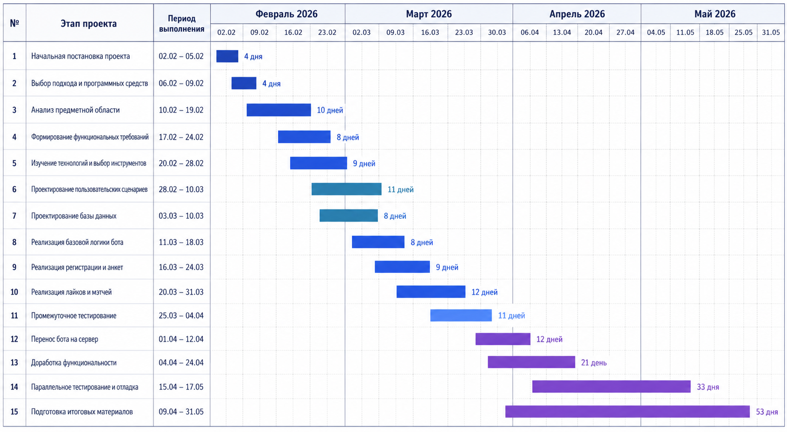

## 2.2. Календарно-ресурсное планирование

При разработке ВК-бота «ГоПати» требовалось заранее определить, какие работы должны быть выполнены, в какие сроки они укладываются и какие ресурсы необходимы на каждом этапе. Проект нельзя рассматривать только как написание программного кода: помимо реализации обработчиков сообщений, он включает проработку сценариев регистрации и просмотра анкет, проектирование структуры данных, хранение пользовательского состояния, интеграцию с платформой «ВКонтакте», настройку сервера и проверку устойчивости готовых функций.

Работа над ботом началась в начале февраля 2026 года. Сначала были определены назначение сервиса и набор базовых пользовательских сценариев. После этого разработка велась постепенно: часть функций была собрана и проверена в локальной среде, затем отдельные сценарии были показаны друзьям для получения первичной обратной связи.

Позже приложение было перенесено на сервер, где потребовалось настроить окружение, прием callback-событий и защищенное соединение. Доработка функциональности при этом продолжалась параллельно с тестированием, поскольку новые ошибки и неудобства выявлялись уже в процессе практической проверки.

Ресурсная структура проекта была достаточно компактной. Основной объем работ выполнялся одним разработчиком, который последовательно совмещал роли аналитика, backend-разработчика, проектировщика базы данных, тестировщика и администратора серверной части. Дополнительно учитывались консультации с научным руководителем и участие тестовых пользователей, помогавших оценить понятность сценариев и стабильность работы бота.

Таблица 6. Календарно-ресурсный план разработки ВК-бота ГоПати

| № | Этап работ | Сроки выполнения | Задействованные ресурсы | Результат этапа |
| --- | --- | --- | --- | --- |
| 1 | Начальная постановка проекта и определение общей логики работы | 02.02.2026 - 05.02.2026 | Разработчик, научный руководитель, исходные требования к проекту, материалы по предметной области | Определены общая цель разработки, ожидаемый результат и основные направления дальнейшей работы |
| 2 | Определение подхода к разработке и выбор программных средств | 06.02.2026 - 09.02.2026 | Разработчик, Python 3.13.6, Visual Studio Code, документация VK API, материалы по разработке ботов | Уточнен общий подход к разработке программного продукта в формате бота |
| 3 | Анализ предметной области | 10.02.2026 - 19.02.2026 | Разработчик, материалы по сервисам знакомств, открытые источники, анализ существующих решений | Определены назначение бота, целевые пользователи и основные сценарии применения |
| 4 | Формирование функциональных требований и ожидаемых результатов | 17.02.2026 - 24.02.2026 | Разработчик, научный руководитель, результаты анализа предметной области, draw.io | Сформирован перечень основных функций: анкеты, игры, профили, лайки, мэтчи, жалобы и восстановление состояния |
| 5 | Изучение технологий и выбор инструментов разработки | 20.02.2026 - 28.02.2026 | Разработчик, Python 3.13.6, VK API, MySQL, DBeaver, Visual Studio Code, Git и GitHub | Обоснован технологический стек и определены инструменты для серверной части, базы данных и интеграции с ВК |

Продолжение таблицы 6 «Календарно-ресурсный план разработки ВК-бота ГоПати»

| № | Этап работ | Сроки выполнения | Задействованные ресурсы | Результат этапа |
| --- | --- | --- | --- | --- |
| 6 | Проектирование структуры диалога и пользовательских сценариев | 28.02.2026 - 10.03.2026 | Разработчик, draw.io, VK API, материалы по логике диалогового взаимодействия с ботом | Определена последовательность регистрации, редактирования анкеты, просмотра профилей и обработки пользовательских действий |
| 7 | Проектирование структуры базы данных и хранения пользовательского состояния | 03.03.2026 - 10.03.2026 | Разработчик, MySQL, DBeaver, XAMPP Control Panel, phpMyAdmin, схема сущностей проекта | Определены основные таблицы, связи между сущностями, хранение анкет, игр, путей к фотографиям, взаимодействий и сессий |
| 8 | Локальная реализация базовой логики бота | 11.03.2026 - 18.03.2026 | Разработчик, Python 3.13.6, Visual Studio Code, VK API, XAMPP Control Panel, phpMyAdmin | Реализован начальный каркас обработки сообщений и базовые переходы между состояниями диалога |
| 9 | Реализация регистрации, анкет, выбора игр и работы с фотографиями | 16.03.2026 - 24.03.2026 | Разработчик, Python 3.13.6, MySQL, VK API, Visual Studio Code, локальное файловое хранилище | Реализованы основные шаги заполнения анкеты, сохранение игровых интересов и работа с фотографиями пользователей |
| 10 | Реализация просмотра анкет, лайков, дизлайков, мэтчей и жалоб | 20.03.2026 - 31.03.2026 | Разработчик, Python 3.13.6, MySQL, VK API, VK-клавиатуры, тестовые данные | Реализованы ключевые сценарии взаимодействия пользователей и фиксации результатов просмотра анкет |
| 11 | Промежуточное тестирование локальной версии и исправление ошибок | 25.03.2026 - 04.04.2026 | Разработчик, тестовые пользователи, Visual Studio Code, DBeaver, журналы ошибок, локальная среда | Проверены основные сценарии, выявлены недочеты в логике диалога и внесены первичные исправления |

Продолжение таблицы 6 «Календарно-ресурсный план разработки ВК-бота ГоПати»

| № | Этап работ | Сроки выполнения | Задействованные ресурсы | Результат этапа |
| --- | --- | --- | --- | --- |
| 12 | Настройка серверной инфраструктуры и перенос бота на сервер | 01.04.2026 - 12.04.2026 | Разработчик, Cloud.ru Evolution, Git и GitHub, MySQL, VK Callback API, удаленная серверная среда | Подготовлена серверная среда, настроен прием callback-событий и обеспечен запуск бота вне локальной среды |
| 13 | Доработка функциональности после развертывания | 04.04.2026 - 24.04.2026 | Разработчик, Cloud.ru Evolution, Python 3.13.6, MySQL, DBeaver, VK API, технические логи | Улучшены пользовательские сценарии, обработка состояний, устойчивость отправки сообщений и работа с данными |
| 14 | Параллельное тестирование, отладка и повышение стабильности | 15.04.2026 - 17.05.2026 | Разработчик, тестовые пользователи, Cloud.ru Evolution, MySQL, DBeaver, технические логи | Проверена работа регистрации, просмотра анкет, лайков, мэтчей, жалоб, восстановления состояния и серверной инфраструктуры |
| 15 | Подготовка итоговых проектных материалов | 09.04.2026 - 31.05.2026 | Разработчик, научный руководитель, Microsoft Word, Microsoft PowerPoint, draw.io, GitHub | Подготовлены текстовые материалы, описание архитектуры, тестирования, экономической и социальной значимости проекта |

Представленный календарно-ресурсный план отражает основные этапы выполнения проекта от организационной подготовки и анализа предметной области до развертывания серверной версии бота и оформления итоговых материалов. Наиболее трудоемкими этапами стали реализация пользовательских сценариев, работа с базой данных, настройка интеграции с платформой «ВКонтакте» и тестирование поведения бота в условиях реального взаимодействия пользователей. Особенностью проекта является то, что часть задач выполнялась параллельно: разработка новых функций продолжалась одновременно с проверкой уже реализованных сценариев и исправлением выявленных ошибок.

Для более наглядного представления сроков выполнения работ может быть использована диаграмма Ганта (рис. 6). Она позволяет показать длительность этапов, их взаимное наложение и периоды наибольшей нагрузки. В рамках данного проекта диаграмма особенно полезна для отображения того, что локальная разработка, тестирование, перенос на сервер и последующая доработка выполнялись не строго последовательно, а частично пересекались по времени.

Рисунок 6 – Диаграмма Ганта календарного плана разработки ВК-бота «ГоПати»
