## 3.3. Проектирование структуры БД

База данных является одним из ключевых компонентов информационной системы ГоПати, поскольку именно она обеспечивает хранение анкет пользователей, игровых интересов, фотографий, истории взаимодействий и служебных данных, необходимых для корректной работы ВК-бота. Качество проектирования структуры БД напрямую влияет на устойчивость работы системы, скорость обработки пользовательских сценариев и возможность дальнейшего расширения функциональности.

Архитектура базы данных проекта реализована на основе реляционной модели. В структуре БД выделены основные сущности, отражающие логику работы приложения: пользователи, профили, игры, связи пользователей с играми, фотографии, взаимодействия между пользователями, взаимные совпадения, отложенные лайки и пользовательские сессии. Такое разделение позволяет избежать дублирования информации, упростить сопровождение системы и повысить прозрачность логики хранения данных.

Концептуальная модель базы данных

Перед переходом к физическому проектированию базы данных была разработана концептуальная модель, отражающая основные сущности предметной области и связи между ними. На данном уровне модель не описывает технические детали реализации, типы данных, индексы и служебные таблицы, а показывает логическую структуру данных, необходимую для работы ВК-бота «ГоПати».

В концептуальной модели выделены сущности «Пользователь», «Профиль анкеты», «Фотография», «Игра», «Фильтры поиска» и «Взаимодействие». Сущность «Пользователь» является центральной, так как с ней связаны анкета, фотографии, игровые интересы, параметры поиска и действия по отношению к другим пользователям. Сущность «Профиль анкеты» хранит основные анкетные сведения пользователя: имя, возраст, город, описание, пол и признак использования микрофона. Сущность «Фотография» отражает изображения, прикрепленные к анкете, и порядок их отображения.

Сущность «Игра» используется как справочник доступных игр. Один пользователь может выбрать несколько игр, и одна игра может быть указана у многих пользователей, поэтому между пользователями и играми формируется связь многие-ко-многим. Аналогично игры могут использоваться в фильтрах поиска: один набор фильтров может включать несколько обязательных игр, а одна игра может встречаться в фильтрах разных пользователей. Сущность «Фильтры поиска» описывает пользовательские параметры подбора анкет, включая предпочитаемый пол, возрастной диапазон, сортировку и требование к использованию микрофона.

Сущность «Взаимодействие» отражает действия пользователей по отношению друг к другу: лайк, дизлайк и сообщение, прикрепленное к лайку. На концептуальном уровне входящие лайки и взаимные совпадения рассматриваются как часть общего процесса взаимодействия пользователей. На физическом уровне этот процесс дополнительно разделен на таблицы `interactions`, `pending_likes` и `matches`, так как в реализации бота требуется отдельно хранить историю действий, очередь входящих лайков и уже сформированные взаимные совпадения. Такое разделение относится к уровню реализации и не меняет смысловой структуры предметной области.

Концептуальная диаграмма позволяет показать основные связи между сущностями до этапа нормализации и физического проектирования. Она служит основой для дальнейшего разбиения данных на таблицы, определения первичных и внешних ключей, а также выбора структуры связующих таблиц для отношений многие-ко-многим.

Нормализация базы данных

При проектировании базы данных использовались принципы нормализации, направленные на снижение избыточности данных и предотвращение аномалий вставки, удаления и обновления. Для проекта была выбрана третья нормальная форма (3НФ) как практический компромисс между логической строгостью модели и удобством реализации прикладных запросов [2; 3].

Требования к третьей нормальной форме в контексте проектируемой базы данных:

Все атрибуты таблиц содержат атомарные значения.

В таблицах отсутствуют повторяющиеся группы атрибутов.

Каждая запись таблицы однозначно идентифицируется первичным ключом.

Каждый неключевой атрибут полностью зависит от первичного ключа.

Между неключевыми атрибутами отсутствуют транзитивные зависимости.

Применение 3НФ в проекте ГоПати позволило разнести данные по логически самостоятельным таблицам. Например, сведения о пользователях и их анкетных данных отделены от таблиц игровых предпочтений, фотографии вынесены в отдельную сущность, а история взаимодействий и совпадений хранится независимо от основной информации профиля. Это упрощает выполнение операций обновления, уменьшает избыточность хранения и повышает согласованность данных.

Физическая модель БД

Физическая модель БД была спроектирована на локальном компьютере в программе DBeaver (рис. 7).

Рисунок 7 – Физическая модель базы данных ВК-бота «ГоПати»

Основные таблицы в БД

Таблица «users» содержит базовую информацию о зарегистрированных пользователях бота. В ней хранится внутренний идентификатор пользователя, идентификатор пользователя во ВКонтакте («vk_user_id») и дата создания записи. Поле «vk_user_id» является уникальным, что исключает повторную регистрацию одного и того же пользователя в системе (рис. 8).

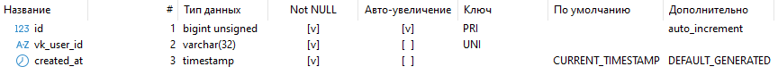

Рисунок 8 – Структура таблицы пользователей «users» базы данных ВК-бота «ГоПати»

Таблица «profiles» содержит основную информацию анкеты пользователя: имя, возраст, город, описание, пол и использует ли пользователь микрофон. Кроме анкетных данных, в таблице хранятся служебные признаки активности профиля, блокировки пользователя, причины и времени блокировки, а также технические поля, связанные с доставкой сообщений через VK API. Поле «games_step_completed» показывает, завершил ли пользователь этап выбора игр при заполнении анкеты (рис. 9).

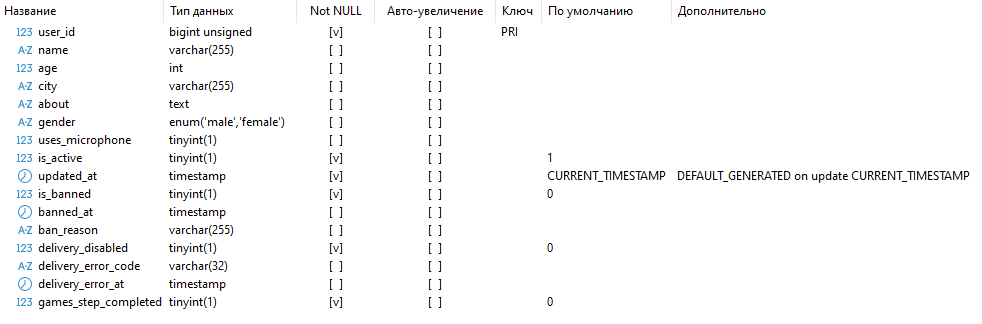

Рисунок 9 – Структура таблицы профилей пользователей «profiles» базы данных ВК-бота «ГоПати»

Таблица «games» содержит справочную информацию о доступных играх, которые пользователь может выбрать в своей анкете. Для каждой игры хранится числовой идентификатор, уникальный код и отображаемое название. Использование отдельного справочника позволяет не дублировать названия игр в пользовательских анкетах и упрощает расширение списка доступных игр (рис. 10).

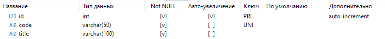

Рисунок 10 – Структура таблицы игр «games» базы данных ВК-бота «ГоПати»

Таблица «user_games» является промежуточной таблицей между таблицами «users» и «games» и содержит сведения о выбранных пользователем играх. Составной первичный ключ по полям «user_id» и «game_id» не допускает повторного добавления одной и той же игры одному пользователю. Поле «created_at» фиксирует время выбора игры (рис. 11).

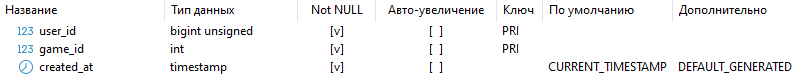

Рисунок 11 – Структура таблицы связи пользователей и игр «user_games» базы данных ВК-бота «ГоПати»

Таблица «user_photos» содержит информацию о фотографиях, прикрепленных к анкете пользователя. В ней хранится путь к локально сохраненному файлу фотографии, порядок отображения, дата добавления и технический токен «vk_photo_token», который может использоваться для повторной отправки уже загруженной фотографии через VK API. Ограничение уникальности по полям «user_id» и «sort_order» обеспечивает корректный порядок фотографий внутри одной анкеты (рис. 12).

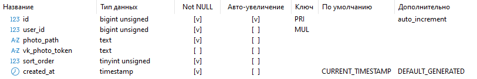

Рисунок 12 – Структура таблицы фотографий пользователей «user_photos» базы данных ВК-бота «ГоПати»

Таблица «interactions» содержит информацию о действиях пользователей по отношению друг к другу, включая лайки и дизлайки. В таблице фиксируются пользователь-инициатор, целевой пользователь, тип действия и время его выполнения. Уникальное ограничение по паре «from_user_id» и «to_user_id» позволяет хранить только одно актуальное действие одного пользователя по отношению к другому (рис. 13).

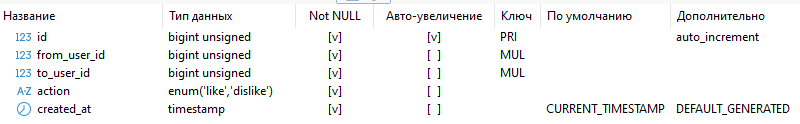

Рисунок 13 – Структура таблицы пользовательских взаимодействий «interactions» базы данных ВК-бота «ГоПати»

Таблица «pending_likes» содержит информацию о входящих лайках, на которые целевой пользователь еще не ответил, а также данные о статусе ответа. В ней хранятся идентификаторы отправителя и получателя лайка, действие ответа («response_action»), время уведомления, время ответа, дата создания записи и текст сопроводительного сообщения «like_message», если пользователь добавил его при отправке лайка (рис. 14).

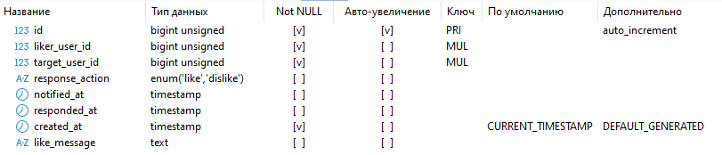

Рисунок 14 – Структура таблицы отложенных лайков «pending_likes» базы данных ВК-бота «ГоПати»

Таблица «matches» содержит информацию о взаимных симпатиях пользователей, то есть о случаях, когда два пользователя поставили друг другу лайк. В таблице сохраняются идентификаторы двух пользователей и дата создания совпадения. Уникальное ограничение по паре пользователей предотвращает дублирование одного и того же взаимного совпадения
(рис. 15).

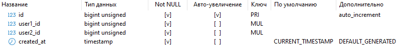

Рисунок 15 – Структура таблицы взаимных совпадений «matches» базы данных ВК-бота «ГоПати»

Таблица «user_sessions» содержит сохраненное состояние пользовательского диалога с ботом и используется для восстановления сценария после повторного обращения пользователя или перезапуска приложения. В таблице хранится идентификатор пользователя «user_id», сериализованное состояние диалога «session_json» и время последнего обновления записи «updated_at» (рис. 16).

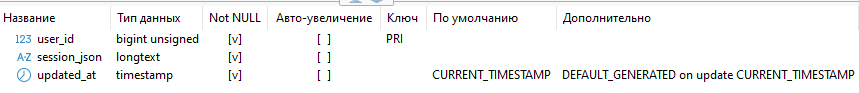

Рисунок 16 – Структура таблицы пользовательских сессий «user_sessions» базы данных ВК-бота «ГоПати»

Поле «session_json» представляет собой JSON-объект с runtime-данными пользовательского сценария. Пример структуры такого объекта, взятый из текущей базы данных, приведен на рисунке 17. В нем сохраняется ключ «step», определяющий текущий этап диалога, например просмотр анкет, редактирование профиля или отправку сообщения к лайку. Ключ «current_candidate» хранит идентификатор анкеты, которая в данный момент показана пользователю. Ключ «games_step_completed» показывает, завершил ли пользователь этап выбора игр. Ключ «browse_mode» определяет источник выдачи анкет: значение «new» означает просмотр новых кандидатов, а значение «history» - просмотр ранее оцененных анкет.

Для режима истории используются поля «history_candidate_action», «history_cursor_id» и «history_cursor_created_at»: они фиксируют последнее действие пользователя, позицию в истории и дату записи, от которой продолжается листание. Поле «pending_like_profile» хранит временные данные об анкете входящего лайка, если пользователь находится в сценарии ответа на симпатию. Поля «like_message_target_vk_user_id» и «like_message_resume_step» используются, когда пользователь добавляет текстовое сообщение к лайку: первое поле хранит получателя сообщения, второе - шаг, на который нужно вернуться после отправки. Поля «report_target_vk_user_id» и «report_resume_step» аналогично применяются при отправке жалобы на анкету. Поле «had_photos_before_edit» показывает, были ли у пользователя фотографии до начала редактирования анкеты. Поле «resume_step» хранит шаг, к которому нужно вернуться после временного перехода в другой сценарий, а «suppress_post_match_prompt» используется как служебный флаг для управления сообщениями после взаимного совпадения. Благодаря хранению этих данных бот может продолжить диалог с того же места, на котором пользователь остановился.

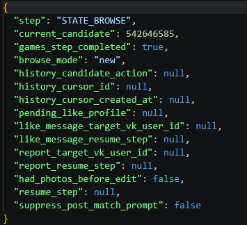

Рисунок 17 – Пример содержимого поля «session_json» для хранения состояния пользователя

Таблица «user_filters» содержит пользовательские параметры фильтрации и сортировки анкет, применяемые при подборе кандидатов. В ней сохраняются предпочитаемый пол кандидатов, режим сортировки, минимальный и максимальный возраст, а также предпочтение по использованию микрофона. Обязательные игры для поиска не хранятся в этой таблице, так как пользователь может указать несколько игр; для этого используется отдельная связующая таблица «user_filter_games» (рис. 18).

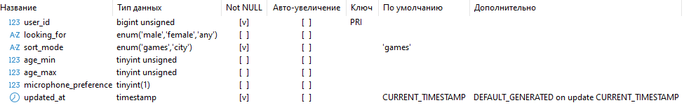

Рисунок 18 – Структура таблицы пользовательских фильтров «user_filters» базы данных ВК-бота «ГоПати»

Таблица «user_filter_games» является промежуточной таблицей между таблицами «users» и «games» и содержит информацию об играх, выбранных пользователем как обязательные для фильтрации при поиске анкет. Она позволяет хранить набор игровых требований отдельно от основной анкеты пользователя и не смешивать интересы пользователя с текущими параметрами поиска (рис. 19).

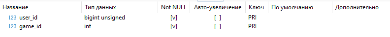

Рисунок 19 – Структура таблицы связи фильтров и игр «user_filter_games» базы данных ВК-бота «ГоПати»

Итоги проектирования БД

Архитектура базы данных ГоПати, реализованная на основе реляционной модели и приведенная к третьей нормальной форме, удовлетворяет ключевым требованиям разрабатываемой системы. Выбранные решения обеспечивают надежное хранение анкет пользователей, игровых предпочтений, фотографий, истории взаимодействий, входящих лайков, взаимных совпадений, пользовательских фильтров и runtime-состояния диалога с ботом. Использование внешних ключей и уникальных ограничений поддерживает целостность связей между основными сущностями и снижает риск появления дублирующихся или несогласованных данных.

Актуальная структура БД также учитывает технические особенности работы VK-бота: хранение локальных путей к фотографиям и «vk_photo_token», признаки недоступности доставки сообщений, параметры модерации, состояние прохождения сценария и настройки фильтрации кандидатов. Сформированная структура базы данных создает устойчивую основу для функционирования ВК-бота, дальнейшего расширения его функциональности и возможной интеграции с дополнительными сервисами аналитики, модерации и рекомендаций.
