## 3.4. Проектирование пользовательского интерфейса

Пользовательский интерфейс ВК-бота ГоПати представляет собой диалоговую систему, в которой пользователь последовательно проходит запуск, регистрацию, заполнение анкеты, настройку фильтров, просмотр профилей и действия по отношению к ним. В отличие от веб- и мобильных приложений, интерфейс бота строится на последовательности сообщений, кнопок, inline-кнопок и состояний диалога. Это позволяет организовать взаимодействие в привычной для «ВКонтакте» среде и снизить порог входа в сервис.

При проектировании использованы принципы «user-centered design» и «progressive disclosure», при котором информация и действия раскрываются поэтапно в зависимости от текущего сценария [13]. Пользователь не получает сразу весь объем функциональности, а проходит логически связанные шаги: запуск бота, заполнение анкеты, просмотр пользователей, настройку фильтров, редактирование анкеты и обработку входящих лайков.

Для проектирования пользовательского взаимодействия была построена User Flow диаграмма (рис. 20). Она отражает основные переходы между состояниями системы: проверку наличия анкеты, регистрацию, экран своей анкеты, фильтры, просмотр и оценку анкет, лайк с сообщением, жалобу, редактирование профиля, отключение и повторное включение анкеты. Диаграмма позволяет наглядно представить пользовательские маршруты, точки принятия решений и общую навигационную логику бота.

Начальная точка взаимодействия с ботом представляет собой стартовый сценарий, в рамках которого пользователь впервые обращается к системе. После запуска бот проверяет, существует ли у пользователя анкета. Если анкеты нет, запускается процесс регистрации и последовательного заполнения профиля. Если анкета уже существует, пользователь сразу попадает к экрану своей анкеты и может перейти к просмотру кандидатов, редактированию профиля, фильтрам или отключению анкеты.

Сценарий регистрации включает ввод имени, возраста, города, пола, указание того, кого пользователь ищет, выбор игр, ответ на вопрос об использовании микрофона, добавление описания и загрузку от одной до трех фотографий (рис. 21, 22, 23, 24). Подобная структура интерфейса позволяет обеспечить стандартизированное и последовательное получение всех необходимых данных для последующего подбора анкет. Для упрощения заполнения анкеты бот автоматически пытается получить имя, возраст, город и пол пользователя из открытых данных профиля «ВКонтакте». При этом пользователь может изменить автоматически определенные значения вручную.

Рисунок 20 – User Flow диаграмма пользовательских сценариев взаимодействия с ВК-ботом «ГоПати»

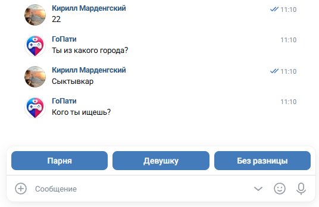

Рисунок 21 – Ввод основных данных и указание фильтра по полу при регистрации в ВК-боте «ГоПати»

Отдельное внимание при проектировании уделяется интерфейсу выбора игр (рис. 22). В отличие от обычного текстового ввода, данный шаг реализуется с помощью inline-кнопок. Каждая кнопка переключает выбранную игру, а состояние выбора отображается визуально с помощью отметки. Пользователь может выбрать несколько игр из справочника, после чего подтверждает выбор кнопкой «Готово». Такой формат взаимодействия упрощает ввод данных, снижает вероятность ошибок и делает процесс выбора игровых интересов более быстрым.

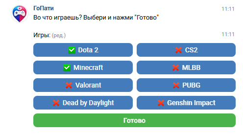

Рисунок 22 – Выбор игр при регистрации в ВК-боте «ГоПати»

После выбора игр бот уточняет, играет ли пользователь с микрофоном (рис. 23). Этот параметр важен для подбора игровых напарников, так как часть пользователей предпочитает голосовое общение во время игры. Вопрос реализован через кнопки «Да» и «Нет», что делает ввод быстрым и исключает неоднозначные текстовые ответы.

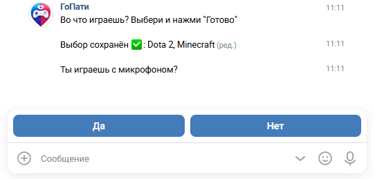

Рисунок 23 – Выбор ответа на вопрос об использовании микрофона при регистрации в ВК-боте «ГоПати»

На завершающих этапах регистрации пользователь добавляет описание и фотографии (рис. 24). Описание используется для более полного представления анкеты, а фотографии позволяют сделать профиль визуально информативным. В интерфейсе предусмотрено ограничение от одной до трех фотографий.

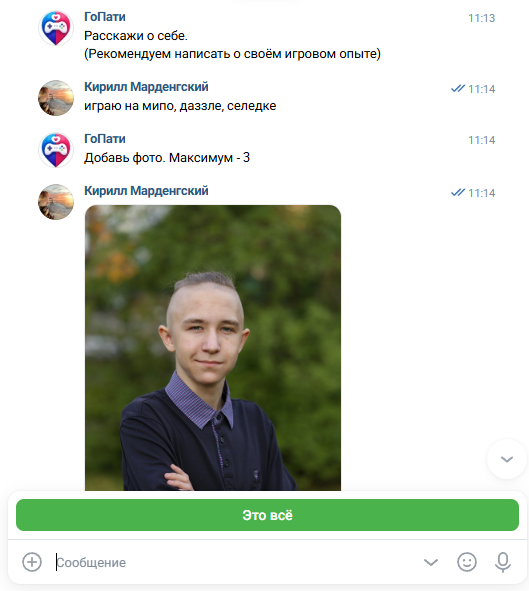

Рисунок 24 – Добавление описания и фото при регистрации в ВК-боте «ГоПати»

После завершения регистрации пользователь попадает на экран своей анкеты (рис. 25). Этот экран выполняет роль главного меню: из него можно начать просмотр анкет, открыть настройки фильтров, перейти к редактированию профиля или временно отключить анкету. В интерфейсе собственной анкеты основными кнопками являются «Смотреть анкеты», «Редактировать анкету», «Фильтры» и «Отключить анкету». Такой подход делает навигацию предсказуемой: после завершения значимых сценариев бот возвращает пользователя к понятной точке управления.

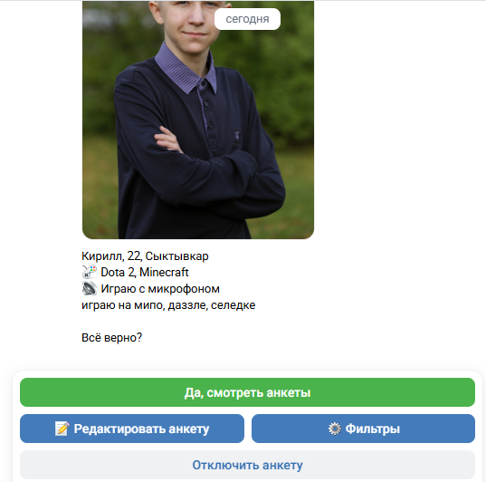

Рисунок 25 – Просмотр собственной анкеты в ВК-боте «ГоПати»

Отдельная ветка пользовательского маршрута связана с настройкой фильтров подбора (рис. 26). Переход к ней выполняется с экрана своей анкеты. В окне фильтров пользователь видит текущие параметры поиска и может выбрать, какую настройку изменить: пол искомого пользователя, сортировку анкет, возрастной диапазон, обязательные игры или требование к микрофону. Наличие отдельного экрана фильтров важно с точки зрения UX, поскольку параметры поиска не смешиваются с редактированием собственной анкеты. Пользователь может уточнять выдачу кандидатов, не изменяя информацию о себе.

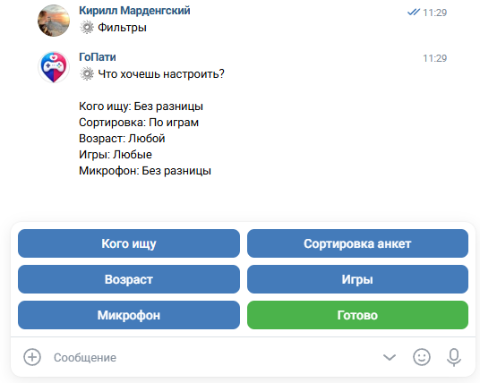

Рисунок 26 – Настройка фильтров подбора анкет в ВК-боте «ГоПати»

Внутри сценария фильтрации предусмотрены несколько вложенных окон (рис. 27-31). При настройке фильтра по полу пользователь указывает, анкеты каких пользователей должны отображаться в выдаче. При выборе сортировки пользователь определяет, какие анкеты показывать в первую очередь: с наибольшим количеством общих игр или из того же города. При настройке возраста бот последовательно запрашивает минимальный и максимальный возраст, а значение 0 позволяет сбросить ограничение. В разделе игр пользователь выбирает обязательные игры через inline-кнопки и подтверждает выбор кнопкой «Готово». В разделе микрофона можно указать, нужны ли только пользователи с микрофоном, либо оставить этот параметр без строгого ограничения. Такая структура соответствует диаграмме user-flow: каждый параметр фильтра оформлен как отдельное окно, после изменения которого пользователь возвращается к общему экрану настройки фильтров.

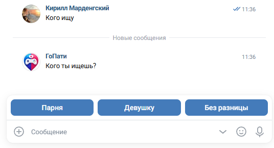

Рисунок 27 – Настройка фильтра по полу в ВК-боте «ГоПати»

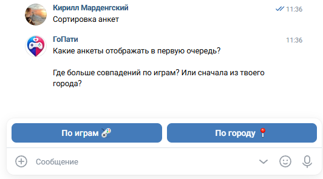

Рисунок 28 – Настройка сортировки анкет в ВК-боте «ГоПати»

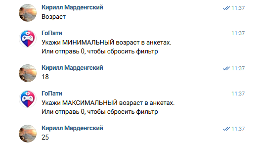

Рисунок 29 – Настройка фильтра по возрасту в ВК-боте «ГоПати»

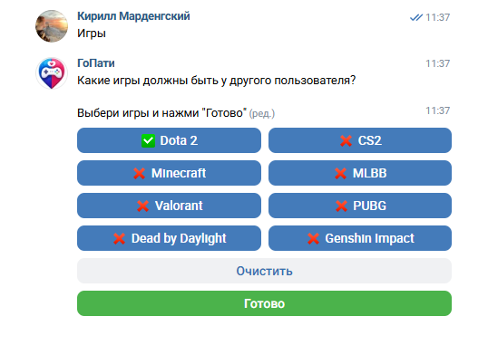

Рисунок 30 – Настройка фильтра по играм в ВК-боте «ГоПати»

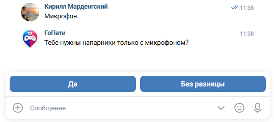

Рисунок 31 – Настройка фильтра по микрофону в ВК-боте «ГоПати»

Ключевым элементом пользовательского опыта является сценарий просмотра анкет других пользователей (рис. 32). Каждая анкета содержит имя, возраст, город, описание, выбранные игры, информацию об использовании микрофона и фотографии. Такое представление позволяет пользователю быстро оценивать релевантность кандидата не только как игрового напарника, но и как потенциального собеседника для дальнейшего общения вне игры. Наличие фотографий и текстового описания делает взаимодействие менее формальным и повышает качество пользовательского выбора.

Во время просмотра анкеты пользователю доступны основные действия: поставить лайк, поставить лайк с сообщением, поставить дизлайк, пожаловаться на анкету, вернуться к предыдущей анкете или перейти в свою анкету. Лайк с сообщением открывает дополнительное диалоговое окно, где пользователь вводит текст, который будет передан вместе с лайком. Если пользователь находится в режиме истории просмотренных анкет, интерфейс дополнительно позволяет вернуться к новым анкетам. При этом повторное изменение оценки для уже лайкнутой анкеты ограничивается, что предотвращает противоречивые действия и упрощает обработку истории взаимодействий.

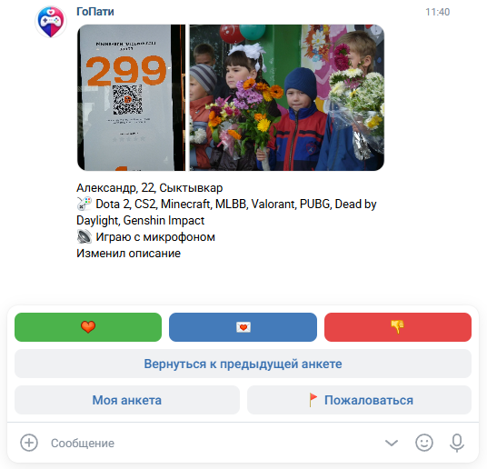

Рисунок 32 – Просмотр чужой анкеты в ВК-боте «ГоПати»

Также в структуре интерфейса предусмотрен отдельный сценарий управления собственной анкетой. Пользователь может перейти к редактированию отдельных разделов профиля (рис. 33, 34). Меню редактирования содержит разделы «Основное», «Описание», «Игры», «Фото» и кнопку возврата назад. В разделе «Описание» пользователь обновляет текст анкеты, в разделе «Игры» изменяет собственный список игр, а в разделе «Фото» заменяет фотографии профиля. Раздел «Основное» раскрывается в отдельное окно, где можно изменить имя, возраст, пол, город и признак использования микрофона. Такое разделение делает интерфейс более гибким и позволяет избежать повторного заполнения всей анкеты для изменения одного поля.

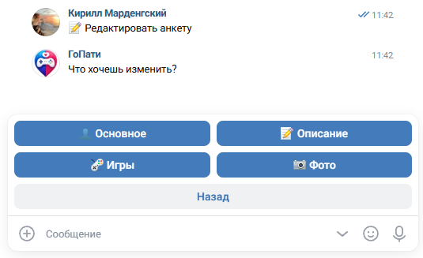

Рисунок 33 – Выбор раздела редактирования анкеты в ВК-боте «ГоПати»

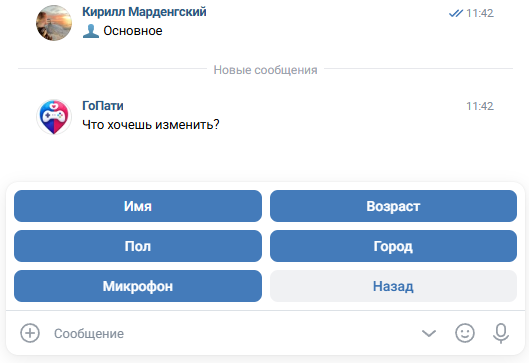

Рисунок 34 – Выбор данных для изменения в разделе «Основное» в ВК-боте «ГоПати»

Отдельный сценарий связан с историей просмотренных анкет. Пользователь может вернуться к предыдущей анкете или просматривать историю уже оцененных профилей. Это особенно важно для диалогового интерфейса, где пользователь не видит перед собой список карточек, как в веб-приложении. История помогает компенсировать линейность сообщений и делает просмотр анкет более управляемым. В интерфейсе при этом сохраняются ограничения: если анкета уже была лайкнута, изменить оценку нельзя, но можно вернуться к новым анкетам или отправить жалобу.

С точки зрения UX важным преимуществом интерфейса ГоПати является встроенная обработка специальных ситуаций. К ним относятся входящие лайки (рис. 35), формирование взаимного совпадения пользователей (рис. 36), отправка жалобы на анкету (рис. 37), восстановление пользовательского состояния после перезапуска бота, возврат к предыдущему сценарию взаимодействия, временное отключение анкеты и повторное включение анкеты при возвращении к просмотру.

При входящем лайке бот показывает пользователю анкету человека, которому понравился его профиль. В этом окне набор действий специально ограничен: пользователь может только оценить анкету лайком, лайком с сообщением или дизлайком, а также отправить жалобу. Переход к собственной анкете или возврат к предыдущей анкете на этом шаге не предлагается, чтобы пользователь сначала обработал входящую симпатию. Если ответный лайк приводит к взаимному совпадению, бот сообщает обоим пользователям о мэтче и показывает ссылки на профили друг друга. Такой сценарий делает взаимодействие асинхронным: пользователь не обязан находиться в боте в момент получения лайка, но при следующем обращении может обработать входящую симпатию.

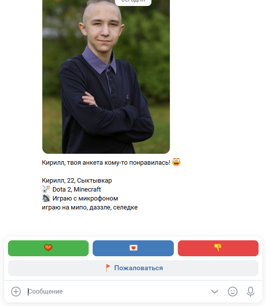

Рисунок 35 – Уведомление о входящем лайке в ВК-боте «ГоПати»

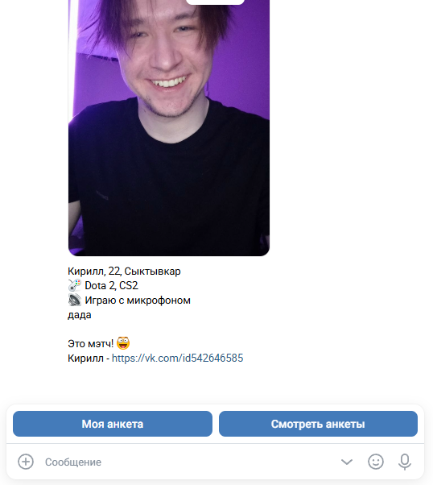

Рисунок 36 – Уведомление о взаимном совпадении пользователей в ВК-боте «ГоПати»

Механизм жалоб используется для пользовательской модерации 
(рис. 37). При выборе жалобы бот запрашивает текст причины, после чего формирует сообщение для модерации и сохраняет отрицательное взаимодействие с анкетой. Для пользователя этот сценарий выглядит как обычный диалоговый шаг, но внутри системы он помогает исключать проблемные анкеты из дальнейшего просмотра и передавать информацию администраторам.

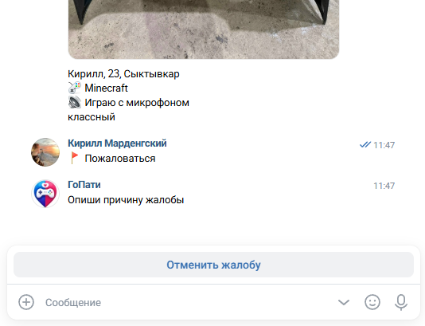

Рисунок 37 – Отправка жалобы на анкету в ВК-боте «ГоПати»

Отдельно в интерфейсе предусматривается сценарий отключения анкеты (рис. 38). Он необходим на случай, если пользователь больше не хочет пользоваться ботом или временно не хочет отображаться в подборе. При выборе отключения бот должен открывать отдельное окно подтверждения, где пользователь может вернуться назад или подтвердить действие. После подтверждения профиль исключается из выдачи другим пользователям, а пользователю предлагаются дальнейшие действия: перейти к своей анкете или снова начать просмотр анкет. При возвращении к просмотру анкета будет включена снова.

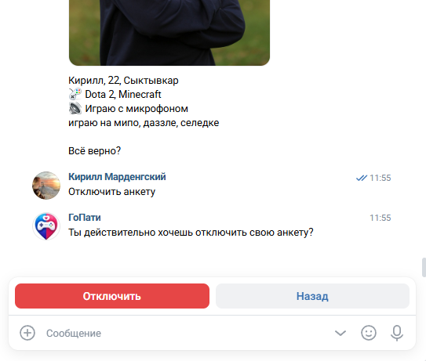

Рисунок 38 – Подтверждение отключения анкеты в ВК-боте «ГоПати»

Очистка истории и полный сброс данных рассматриваются отдельно как временный служебный функционал (рис. 39). Он необходим исключительно для проверки работы бота в условиях небольшого количества пользователей и проработки различных пользовательских сценариев. Очистка истории удаляет прошлые действия просмотра только у текущего пользователя и позволяет начать подбор заново без удаления самой анкеты. Полный сброс удаляет данные анкеты и историю взаимодействий также только у текущего пользователя, после чего он проходит регистрацию заново. Поскольку эти действия предназначены для служебной проверки сценариев, кнопки очистки истории и полного сброса отображаются на этапе просмотра собственной анкеты только при включенном флаге на уровне кода.

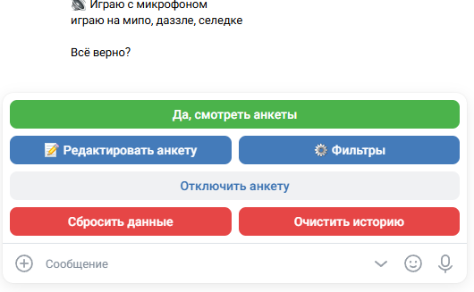

Рисунок 39 – Служебные кнопки очистки истории и сброса данных в ВК-боте «ГоПати»

Устойчивость диалогового интерфейса обеспечивается хранением текущего состояния пользователя. Бот сохраняет текущий шаг сценария, просматриваемую анкету, режим просмотра новых анкет или истории, данные временных сценариев лайка с сообщением и жалобы. Благодаря этому пользователь может продолжить взаимодействие после нового сообщения или перезапуска приложения без потери контекста.

Таким образом, пользовательский интерфейс ВК-бота ГоПати проектируется как последовательная диалоговая среда, адаптированная под специфику платформы «ВКонтакте» и ориентированная на удобный поиск игровых напарников и знакомств среди геймеров. Основными характеристиками такого интерфейса являются пошаговое раскрытие функциональности, структурированность анкетных данных, использование обычных и inline-кнопок, настройка персональных фильтров, поддержка истории просмотра, обработка входящих лайков и мэтчей, возможность отправки жалоб, редактирование профиля и восстановление пользовательского состояния после перезапуска.
