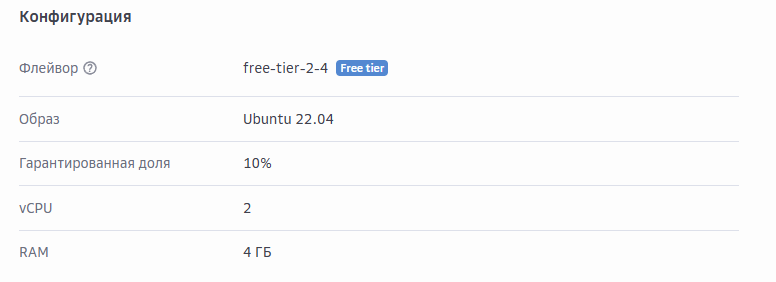
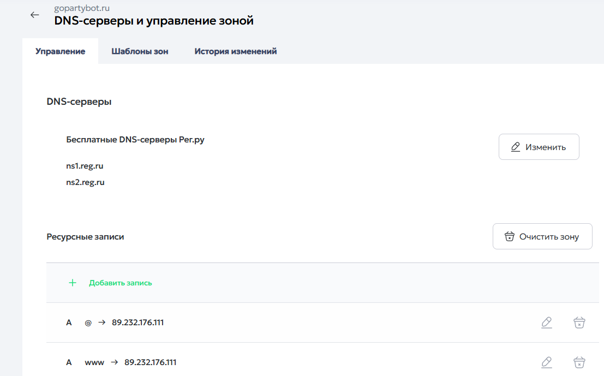
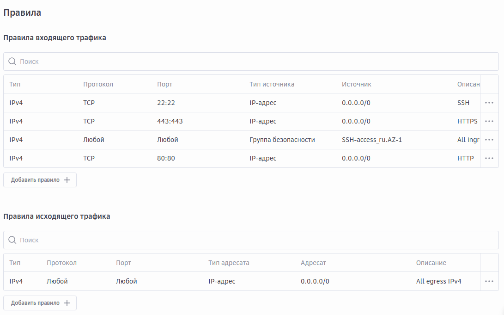
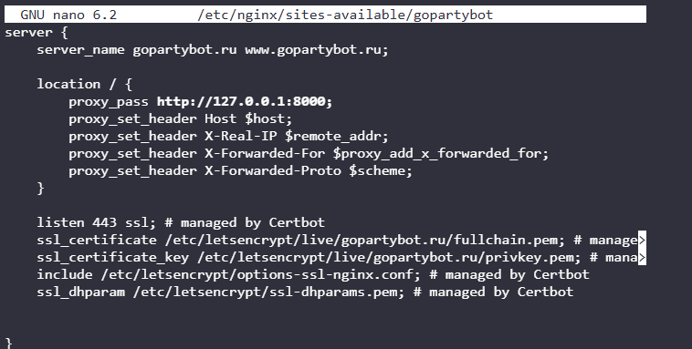
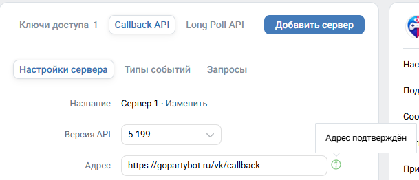

## 4.6. Настройка окружения, базы данных и запуск приложения

Для обеспечения круглосуточной работы ВК-бота ГоПати была выполнена настройка удаленной серверной инфраструктуры [8]. В качестве площадки размещения использовался облачный сервис «Cloud.ru Evolution», в котором был арендован виртуальный сервер стоимостью «150 руб. в месяц». При развертывании был выбран образ «Ubuntu 22.04» со следующими параметрами: загрузочный диск «30 ГБ», гарантированная доля вычислительных ресурсов «10%», «2 vCPU» и «4 ГБ RAM» [22]. Данная конфигурация является достаточной для размещения серверной части бота, reverse proxy, базы данных и вспомогательных компонентов (рис. 40).

Рисунок 40 – Параметры виртуального сервера в Cloud.ru, используемого для размещения ВК-бота «ГоПати»

Для обеспечения работы «ВК Callback API» потребовалось наличие публично доступного домена и HTTPS-соединения. С этой целью был зарегистрирован домен «gopartybot.ru» у регистратора «Reg.ru» стоимостью 169 руб. в год. В DNS-настройках домена были созданы «A»-записи для корневого домена и поддомена «www», указывающие на публичный IP-адрес сервера. Это позволило связать доменное имя с развернутым приложением и использовать единый адрес для обращения со стороны платформы «ВКонтакте» (рис. 41).

Рисунок 41 – DNS-настройки домена gopartybot.ru в панели управления Reg.ru

На сервере была развернута серверная часть приложения на базе «FastAPI», а в качестве reverse proxy использовался «nginx» [20]. HTTP-запросы, поступающие на домен, проксируются во внутреннее приложение по маршруту «https://gopartybot.ru/vk/callback». Такая схема позволила изолировать внутренний Python-процесс от прямого внешнего доступа и обеспечить удобное управление сетевой конфигурацией.

Для открытия доступа к приложению на уровне сетевой безопасности были созданы два TCP-правила межсетевого экрана: для порта «80:80» с описанием «HTTP» и для порта «443:443» с описанием «HTTPS», оба с источником «0.0.0.0/0». Эти правила обеспечили прием обычного HTTP-трафика и защищенного HTTPS-трафика извне (рис. 42).

Рисунок 42 – Правила входящего и исходящего трафиков виртуального сервера

Для выпуска TLS-сертификата был установлен «certbot» (программный инструмент для автоматического получения, установки и продления SSL/TLS-сертификатов от центра сертификации Let's Encrypt).

Был выпущен сертификат для домена и поддомена:

bash

sudo certbot --nginx -d gopartybot.ru -d www.gopartybot.ru

Выпуск сертификата позволил перевести приложение на HTTPS, что является обязательным условием для работы callback-сервера «ВКонтакте» в публичной среде. После получения сертификата «nginx» был настроен на обслуживание защищенного соединения и проксирование запросов к приложению «FastAPI» (рис. 43).

Рисунок 43 – Настройка HTTPS-соединения для домена ГоПати с помощью certbot и nginx

Дополнительно была выполнена настройка конфигурации приложения: заданы токены сообщества ВК, параметры подключения к базе данных, callback-secret и confirmation-token. После запуска приложения был настроен endpoint здоровья «/health», а также обеспечен прием событий «message_new» и «message_event» от платформы ВК. В настройках сообщества «ВКонтакте» callback URL был указан в виде «https://gopartybot.ru/vk/callback» (рис. 44).

Рисунок 44 – Настройка callback-адреса ВК-бота «ГоПати» в панели управления сообществом

Для снижения риска потери данных предусматривается выполнение резервного копирования базы данных перед внесением изменений в структуру БД и выполнением операций массовой обработки данных. В случае возникновения критических ошибок данные могут быть восстановлены из резервной копии, что позволяет сократить время простоя системы и минимизировать потерю пользовательской информации.

Таким образом, этап настройки окружения включал не только запуск Python-приложения, но и создание полноценной удаленной инфраструктуры: аренду облачного сервера, регистрацию домена, выпуск SSL-сертификата, настройку сетевых правил, интеграцию «nginx» и «FastAPI», а также подготовку окружения для приема callback-событий от платформы «ВКонтакте».
