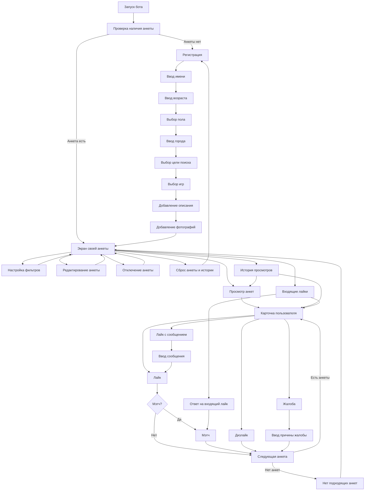

# Техническое задание на генерацию User Flow диаграммы ВК-бота «ГоПати»

Необходимо подготовить user flow диаграмму для ВК-бота «ГоПати». Диаграмма должна показывать путь пользователя внутри бота: запуск, регистрацию, заполнение анкеты, переход к собственной анкете, просмотр других профилей, реакции на анкеты, работу с фильтрами, входящие лайки, жалобы и редактирование профиля.

Диаграмма используется в проектной документации и должна быть похожа по стилю на простую блок-схему пользовательских переходов: прямоугольные блоки с названиями экранов или действий, стрелки между ними, без технических таблиц базы данных, названий Python-файлов и внутренних переменных.

## Общие требования

1. Диаграмма должна быть выполнена в черно-белом или сером стиле.
2. Все элементы должны быть прямоугольниками с тонкой рамкой.
3. Стрелки должны показывать направление перехода пользователя.
4. Главный поток должен идти сверху вниз: запуск бота, регистрация, экран своей анкеты, просмотр анкет.
5. Боковые ветки должны отходить от основных экранов: фильтры, редактирование анкеты, история, жалоба, входящие лайки, отключение и сброс анкеты.
6. Не нужно показывать технические состояния вроде `STATE_BROWSE`, `STATE_REVIEW`, `REG_NAME`.
7. Не нужно показывать таблицы БД, сервер, callback API, файлы проекта и внутренние обработчики.
8. Названия блоков должны быть короткими, чтобы помещаться внутри прямоугольников.

## Основные блоки диаграммы

Использовать следующие блоки:

1. Запуск бота
2. Проверка наличия анкеты
3. Регистрация
4. Ввод имени
5. Ввод возраста
6. Выбор пола
7. Ввод города
8. Выбор цели поиска
9. Выбор игр
10. Добавление описания
11. Добавление фотографий
12. Экран своей анкеты
13. Настройка фильтров
14. Редактирование анкеты
15. Отключение анкеты
16. Сброс анкеты и истории
17. Просмотр анкет
18. Карточка пользователя
19. Лайк
20. Лайк с сообщением
21. Ввод сообщения
22. Дизлайк
23. Мэтч
24. Входящие лайки
25. Ответ на входящий лайк
26. История просмотров
27. Жалоба
28. Ввод причины жалобы
29. Следующая анкета
30. Нет подходящих анкет

## Логика переходов

Основной сценарий:

- `Запуск бота` -> `Проверка наличия анкеты`.
- Если анкета отсутствует: `Проверка наличия анкеты` -> `Регистрация`.
- `Регистрация` -> `Ввод имени` -> `Ввод возраста` -> `Выбор пола` -> `Ввод города` -> `Выбор цели поиска` -> `Выбор игр` -> `Добавление описания` -> `Добавление фотографий` -> `Экран своей анкеты`.
- Если анкета уже есть: `Проверка наличия анкеты` -> `Экран своей анкеты`.

Сценарии с экрана своей анкеты:

- `Экран своей анкеты` -> `Просмотр анкет`.
- `Экран своей анкеты` -> `Настройка фильтров` -> `Экран своей анкеты`.
- `Экран своей анкеты` -> `Редактирование анкеты` -> `Экран своей анкеты`.
- `Экран своей анкеты` -> `Отключение анкеты` -> `Экран своей анкеты`.
- `Экран своей анкеты` -> `Сброс анкеты и истории` -> `Регистрация`.
- `Экран своей анкеты` -> `Входящие лайки`, если у пользователя есть необработанные лайки.

Сценарий просмотра анкет:

- `Просмотр анкет` -> `Карточка пользователя`.
- `Карточка пользователя` -> `Лайк`.
- `Карточка пользователя` -> `Лайк с сообщением` -> `Ввод сообщения` -> `Лайк`.
- `Карточка пользователя` -> `Дизлайк`.
- `Карточка пользователя` -> `Жалоба` -> `Ввод причины жалобы`.
- `Карточка пользователя` -> `История просмотров`.
- После `Лайк`, `Дизлайк` или `Ввод причины жалобы` пользователь переходит к блоку `Следующая анкета`.
- `Следующая анкета` -> `Карточка пользователя`, если подходящие анкеты есть.
- `Следующая анкета` -> `Нет подходящих анкет`, если кандидаты закончились.
- `Нет подходящих анкет` -> `Экран своей анкеты`.

Сценарий мэтча:

- После блока `Лайк` возможен переход к блоку `Мэтч`, если второй пользователь уже поставил встречный лайк.
- `Мэтч` -> `Следующая анкета`.
- Если мэтча нет, `Лайк` -> `Следующая анкета`.

Сценарий входящих лайков:

- `Входящие лайки` -> `Карточка пользователя`.
- Из карточки входящего лайка доступны действия: `Ответ на входящий лайк`, `Лайк с сообщением`, `Дизлайк`, `Жалоба`.
- `Ответ на входящий лайк` -> `Мэтч`.
- `Лайк с сообщением` -> `Ввод сообщения` -> `Мэтч`.
- `Дизлайк` -> `Следующая анкета`.
- `Жалоба` -> `Ввод причины жалобы` -> `Следующая анкета`.
- После обработки входящего лайка пользователь возвращается к следующему входящему лайку или к предыдущему сценарию.

Сценарий истории просмотров:

- `Экран своей анкеты` -> `История просмотров`.
- `История просмотров` -> `Карточка пользователя`.
- Из истории пользователь может просмотреть ранее оцененную анкету и отправить жалобу.
- `История просмотров` -> `Просмотр анкет` для возврата к новым анкетам.

## Рекомендуемая компоновка

Верхняя часть диаграммы:

- по центру разместить `Запуск бота`;
- ниже `Проверка наличия анкеты`;
- ниже цепочку регистрации;
- после регистрации разместить центральный блок `Экран своей анкеты`.

Центральная часть:

- от `Экран своей анкеты` вниз провести основной переход к `Просмотр анкет`;
- ниже разместить `Карточка пользователя`;
- вокруг карточки пользователя разместить действия `Лайк`, `Лайк с сообщением`, `Дизлайк`, `Жалоба`, `История просмотров`.

Левая часть:

- разместить `Настройка фильтров`;
- стрелки: `Экран своей анкеты` -> `Настройка фильтров` -> `Экран своей анкеты`.

Правая часть:

- разместить `Редактирование анкеты`, `Отключение анкеты`, `Сброс анкеты и истории`;
- стрелки должны возвращать пользователя к `Экран своей анкеты`, кроме сброса, который ведет к `Регистрация`.

Нижняя часть:

- разместить `Следующая анкета`, `Мэтч`, `Нет подходящих анкет`;
- показать цикл: `Следующая анкета` -> `Карточка пользователя`;
- показать возврат: `Нет подходящих анкет` -> `Экран своей анкеты`.

## Что не отображать

Не включать в диаграмму:

- таблицы `users`, `profiles`, `interactions`, `matches`, `pending_likes`;
- названия файлов `router.py`, `database.py`, `app.py`;
- внутренние состояния `STATE_*` и `REG_*`;
- технические события `message_new`, `message_event`;
- callback endpoint `/vk/callback`;
- хранение данных в MySQL и локальное файловое хранилище фотографий.

## Подпись к диаграмме

Под диаграммой указать:

`Рисунок X. User Flow диаграмма ВК-бота «ГоПати»`

Если диаграмма вставляется в раздел проектирования пользовательского интерфейса, можно использовать подпись:

`Рисунок X. Пользовательский поток взаимодействия с ВК-ботом «ГоПати»`

## Mermaid-шаблон

При необходимости можно использовать следующий Mermaid-код как основу для генерации диаграммы:

